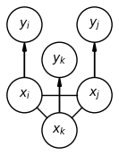
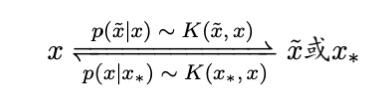
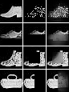
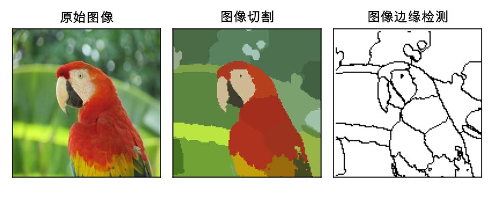

From the local mean to Transformer

**Abstract**

This report introduces a general machine learning framework, termed the localization method, which is rooted in the concept of the local mean and serves as the cornerstone for the self-attention mechanism in the Transformer architecture. The framework is rigorously defined through the establishment of the local model and localization trick, providing a strict and formal expression of its underlying principles. Furthermore, the report delves into the connections between the localization method and an array of other models, such as kernel methods, lazy learning, MeanShift, relaxation labeling, linear neighborhood propagation, and fuzzy inference, et.al.. By examining these relationships, the report aims to illuminate the broader implications and potential applications of the localization method within the field of machine learning.

**Keywords** Local mean, Local model/Localization trick, Kernel method, Meanshift, Self-attention mechanism/Transformer

**Notations**
- sample space: $\mathcal{X}$
- sample squence sp.: $\mathcal{X}^*$
- random variable(rv): $x$
- sample/a family of rvs: $X$ or $\{x_i\}$ (write $\{x_i\}_i$ to stress the index.)
- distribution: $x\sim p$
- machine learning model: $y\sim f(x,\theta)$
- approximation: $X\approx Y$

## Content

- Definition of Local models/Localization trick
- Kernel
- Local mean/self-local mean
- Lazy learning
- Connection with models
- Self-attention mechanism/Transformer
- Extention

## Local models

Assume $l(x,\theta)$ is a loss function and the decision model is an opt. model as follows,
$$
\min_\theta \sum_i l(x_i,\theta)
$$
where $\{x_i\}$ is the sample.

### Local decision models

**Definition（Local decision models）**
Given a target point $x_*$, the local model of (1) is defined as
$$
\min_\theta \sum_i K(x_*,x_i)l(x_i,\theta)
$$
where $l(x,\theta)$ is a loss at the single point $x$, $\{x_i\}$ is the sample. The solution of (2) is related to $x_*$, thus denoted as $\hat{\theta}(x_*)$. We call (2) is the localization of (1).

The total loss on the sample is
$$
J(K)=\sum_i l(x_i,\hat{\theta}(x_i;K))
$$
where $J(K), \hat{\theta}(x_i;K)$ stress that the loss is also related to the kernel $K$, or the kernel matrix $K(X,X)=\{K(x_i,x_j)\}$.

### Localization kernels

A (localization) kernel is a bivariate function on sample space $K:\mathcal{X}\times\mathcal{X}\to \mathbb{R}$ with certain conditions.

The condition for constructing a kernel $K(x,y)$ is very weak: 
1. Non-negativity, i.e., $K(x,y) \geq 0$; 
2. Decrease with distance, i.e., $K(x,y)$ is a decreasing function of $d(x,y)$, where $d$ is the distance on $\mathcal{X}$;
3. Symmetry (not necessarily), i.e., can be represented as $K(x-y)$. Such a kernel (or univariate function $K(\cdot)$) is also known as a convolution kernel.

All of above are optional. Only the first one is assumed by default in most cases.

*Remark.* $K(x,y)$ could be seen as the joint distribution (un-normalized) of $x$ and $y$.

*Remark.* Please note that the localization method is different from the kernel method. There are many connections between the two, but there are also obvious differences. However, the two can definitely be unified.

A kernel $K$ is corresponded to a linear operator on function spaces:
$$
Kf := \int K(x,y) f(y)\mathrm{d}y
$$

#### Normalization

Normalization of kernel $K$:
$\tilde{K}(x,y):=K(x,y)/\int K(x,y)\mathrm{d}y$, the denominator must be positive.

*Remark.* $\tilde{K}(x,y)$ could be seen as the conditional/transition distribution $x\to y$.

A normalized kenerl: $\int K(x,y)\mathrm{d}y=1$
smoothing kenerl: $\int K(x,y)\mathrm{d}y>0$ (at least $\neq 0$)
de-smoothing kernel: $\int K(x,y)\mathrm{d}y=0$

#### Feature mapping

$\phi, \psi:\mathcal{X}\to H$ where $H$ is inner product space, called the feature space.

Construct kernel by two feature mapping.
$K(x,y)=\phi(x)\cdot \psi(y)$ or $=e^{\phi(x)\cdot \psi(y)}$ (for non-negativity)
More generally, $K(x,y)=F(\phi(x), \psi(y))$. Here $\phi$ and $\psi$ are called the query-mapping and key-mapping resp.

*Example.*
$$K(x,y)=\int p(z|x)p(z|y)dz$$

#### (Emperical) Kernel matrix

$K(X,Y)=\{K(x_i,y_j)\}$ where $X=\{x_i\},Y=\{y_j\}$ are samples.

*Remark.* $K(X,X)$ is shorten as $K(X)$.

Similarly feature matrix: $\phi(X):=\{\phi(x_i)\},\psi(Y)=\{\psi(y_i)\}$

Hence, $K(X,Y)=\phi(X)\psi(Y)^T$ or $e^{\phi(X)\psi(Y)^T}$

Normalization of kernel matrix: 

$$
\mathcal{K}(X,Y):=\{\frac{K(x_i,y_j)}{\sum_j K(x_i,y_j)}\}\\
=K(X,Y)\oslash K(X,Y)\mathbf{1}\\
=D^{-1}K(X,Y)
$$

where $D=\mathrm{dial}(\{\sum_j K(x_i,y_j)\})$

#### Laplacian

Laplacian (kernel) of $K$: $L(x,y)=\delta_{xy} -K(x,y)$
normalized Laplacian (kernel) of $K$: $\tilde{L}(x,y)=\delta_{xy} -\tilde{K}(x,y)$

Laplacian (matrix): $L(X,Y)=D -K(X,Y)$ 
Laplacian (matrix): $\tilde{L}(X,Y)=I -\tilde{K}(X,Y)$

Difference kernel: $K_1-K_2$.
Differential kernel: $\lim_{\Delta h\to 0}\frac{K_{h}-K_{h+\Delta h}}{\Delta h}$.

*Remark.* The Laplacian is stemmed from the graph theory. Any graph has its (normalized) laplacian.

#### Connection with PDE

Note that the differential or difference operators are some laplacian kernels.

You are recommended to read the reference `Buades2006`, which will not be analyzed here.

#### Self-localization kernel

A four-varaiate function $K:\mathcal{X}\times\R \times\mathcal{X}\times\R \to \R$ is called self-localization kernel, and correspoing to the non-linear operator:

$$
Kf := \int K(x,f(x),y,f(y))f(y)\mathrm{d}y
$$

### Monte Carlo local models

The Monte Carlo(re-sampling) form:
$$
\sum_i K(x_0,x_i)l(x_i,\theta) \sim \sum_i l(x_i,\theta), x_i\sim p(x_i|x_0)\sim K(x_0,x_i)
$$

Specially, we have the stochastic form:
$$
\sum_i K(x_0,x_i)l(x_i,\theta) \sim l(x_i,\theta), x_i\sim K(x_0,x_i)
$$

### Local model for machine learing

Following def. reflects the original idea of local.

**localization for machine learing**
Given a machine learing model $y\sim f(x,\theta)$, we define its localized model as
$$
\min_\theta \sum_i K(x_0,x_i)|y_i-f(x_i,\theta)|^2
$$
or for some purposes,
$$
\min_\theta \sum_i K(x_0,y_0,x_i,y_i)|y_i-f(x_i,\theta)|^2
$$

### Neighbourhood/Topology

As a typical type of local model:
$$
\min_\theta \frac{1}{N}\sum_i K(x_0,y_0,x_i,y_i)|y_i-f(x_i,\theta)|^2
$$

## Local Mean

### The local mean (for regression)

The terminal goal of the regression is to calculate the **conditional expection**:
$$
E(y|x)\approx \sum_{x_i\in U_x} y_i \quad\text{or}\quad \sum_i y_i p(x_i|x)
$$
where $U_x$ is a certain neighorhood of $x$, $\{x_i,y_i\}$ is the sample.

**Def**
A local mean of the sample $\{(x_i,y_i)\}$ on target var $x_*$, is defined as,
$$
\hat{y}(x_*):=\sum_i K(x_*,x_i)y_i/\sum_i K(x_*,x_i)
$$

*Fact* Any local regression can be reduced to the local mean, approximately.

### The local mode  (for classification)

Similarly, we define *the local mode* as
$$
M(y|x)\approx \max_k \{y_i=k | x_i\in U_x\} \quad\text{or}\quad \max_k\sum_{y_i=k} p(x_i|x)
$$

Hence we define,
$$
\hat{y}(x_*):= \max_k\sum_{y_i=k} K(x_*,x_i)
$$
or
$$
P(y|x_*):= \max_k\sum_{i} K(x_*,x_i) P(y|x_*)
$$

For the binary-classification, i.e. $y=\pm 1$, we define
$$
\hat{y}(x_*):= \mathrm{sign}(\sum_{i} y_iK(x_*,x_i)), y_i=\pm 1
$$

### The self-local mean

**Def. self-local mean**
The **local mean mapping** (or **mean shifting**) is defined as,
$$
m(x_*):=\sum_i K(x_*,x_i)x_i/\sum_i K(x_*,x_i):\mathcal{X}\to\mathcal{X}
$$
The self-local mean is indeed the local mean of the sample $\{(x_i,x_i)\}$. Reversely, The local mean is a special type of self-local mean on $\mathcal{X}\times\mathcal{Y}$.

MeanShift (vector field): $m(x)-x$
MeanShift iteration/updating rule: $x'\leftarrow m(x)$ (hard version) or $x' \leftarrow x + \alpha(m(x)-x)$ (soft/regularized version), $0\leq \alpha\leq 1$ is the learning rate.

**MeanShift algorithm** is the iteration of the mapping $m$.

*Theorem.* $m(x_*)=$

### The self-local mode

People are more accustomed to using **embedding methods**.

**Def local mode**
Assume $v(\cdot)$ represents the onehot encoding (responding proba.) of $x$. The local model
$$
\hat{v}(y_j):= \sum_{s} K(x_i,x_j) v(x_j)/\sum_{j} K(x_i,x_j)
$$
or
$$
\hat{v}(x_j):= \sum_{s} K(x_i,x_j) v(x_j)/\sum_{j} K(x_i,x_j)
$$

Assume $\phi,\psi$ are the feature mapping of $K$, then we introduce
**The query-key-value(Q-K-V) representation**: $(\phi,\psi,v)$ for $\mathcal{X}$

### Local model for autoregression(AR)

Considier the AR (or dynamics or time series) as follows,
$$
x_{t+1}\sim f(x_t,t), x_t\in\mathcal{X},t=1,2,\cdots
$$

Assume that $\mathcal{X}$ is a Eucliean space (or its subset).
According to the def. of self local model, the local model of (x.x) could be expressed as,
$$
\hat x_{t+1}:= \sum_s K(x_t,t,x_{s},s)x_{s+1}/\sum_s K(x_t,t,x_s,s)
$$
regarding the tuple $(x_{t}, t)$ as the input and $x_{t+1}$ as the output.

We prefer the following form (I'd like call it  *the local time-series model*).
**Def Local AR/Dynamical system**
The local model of (x.x) is called the local AR or local DS, expressed as,
$$
m(x_{t}):= \sum_s K(x_t,t,x_s,s)x_{s}/\sum_s K(x_t,t,x_s,s)
$$
where $t$ could take any type of values in principle.

*Remark.* The local time-series model is indeed the local mean under the self-localization kernel.

## Self-attation system

### Self-attention 1

**Def self-attention(Relative Positional Embedding)**
One possible design of $K$ is $K_1(x_t,x_s)K_2(t,s)$, where $K_1$ represent the grahic-dependence of elements in $\mathcal{X}$ statically and $K_2$ represents the "position-encoding". 

Hence what the localization really dose is to transform the time-dependency to graphic-dependency.

When the kernel is unrelated to the positions, namely $K$ is designed as $K(x_t,x_s)$, it is reduced to local average.

*Example*
Let $K_2(t,s)=1_{|t-s|<\delta}$,
$$
m(x_{t}):= \sum_{|t-s|<\delta} K(x_t,x_s)x_{s}/\sum_{|t-s|<\delta} K(x_t,x_s)
$$

### Self-attention 2

**Def self-attention(Absolute Positional Embedding)**
self attention is a local dynamical system with kernel $K(x_t+p(t),x_s+p(s))$ where $p(t)$ is the position-encoding of $t$.

**Def Transformer**
The Transformer, the most popular large model structure, is identified with the local model with $m^{(6)}(x_{t})$, iterating $m$ six times.

Strictly, the local dynamical system should learn $K$ to implement the self-attention, that is to solve the followint opt problem:
$$
\min_K J(K):=\|X-KX\|^2_{F}
$$
where $K=\{K(x_t,t,x_s,s)\}_{st},X=\{x_{t}^{(j)}\}_{tj}$。

*Fact* Transformer is a seq. model of MeanShift.

### Self-attention 3/key-query-value model

For the discrete case, we should consider the self-local mode.

**Def self-local mode**
$$
\hat{x}_{t}:= \argmax_x\sum_{x_s=x} K(x_t,t,x_s,s)
$$

Or using embedding method
**Def self-local mode**
Assume $v(x)$ represents the onehot encoding (responding proba.) of $x$.
$$
\hat{v}(x_t):= \sum_{s} K(x_t,t,x_s,s) v(x_s)/\sum_{s} K(x_t,t,x_s,s)
$$

The *time-series Q-K-V representation*: $(\phi(x_t,t),\psi(x_t,t),v(x_t))$. It is called the *key-query-value model* in `Vaswani2017`.

## Other models

### the Lazy learning/model

**Lazy learning/models**: A mode whose prediction does not rely on a substantial parameter estimation process.

Hence the non-parametric models are probably lazy models.

Give a parameteric model $P(x|\theta)$, we have to estimate $\hat{\theta}(X)$ where $X$ is a sample. Then predict $\hat{x} = T(x|\hat{\theta})$ (hard) or $x\sim P(x|\hat{\theta})$ (soft).
A lazy model only has prediction task (called lazy prediction): $x\sim P(x|X)$ or $\hat{x}=T(x;X)=T(X)x$. If $T(x)$ is linear, we call it linear lazy model.

**Lazy mapping**: $X\mapsto \{T(x_i;X)\}:\mathcal{X}^N\to \mathcal{X}^N$.

*Remark.* (self)-local-mean is the general form of linear lazy model.

Introducing the conditional varable, we get the usual form of lazy prediction/model/learning:
$$
\hat{y}(x) = T(x;X,Y)
$$
where $X=\{x_i\},Y=\{y_i\}$ are samples.

**Lazy mapping**: $Y\mapsto \{T(x_i;X,Y)\}:\mathcal{Y}^N\to \mathcal{Y}^N$.

Lazy mapping iteration/prediction iteration: Iteration the lazy mapping can to the tasks of unsupervised learning.

**propagation learning/model**

### Relaxation labeling

See the reference `Hummel1983`.

### Linear neighborhood propagation

Another type of relaxation labeling

### Hopfield

Wlog, assume $\mathcal{X}=\{-1,1\}^p$
*Linear self local mode*: $M_k(x_*;X):=\mathrm{sign}(m_K(x_*;X))=\mathrm{sign}(\sum_i\phi(x_*)\cdot \psi(x_i)x_i)$
that is linear wrt $\phi(x)$.

*Hopfield network*: Let $\phi(x)=\psi(x)=x$. we get Hopfield network $\mathrm{sign}(x_*^TXX^T)$

*Remark* There is no linear self local mean.

### Query model

The query model: $T(\{K(x_*,x_i)\},y_i)$, where $T$ is the query operator, and $\{K(x_*,x_i)\}$ represents the matching result formally. 

If $T$ is a linear operator, then it is indeed the local mean.

### Fuzzy inference

| Fuzzy math| probability theory|
|---|---|
|membership function|probability density|
|fuzzification| transition/conditional probability|

Fuzzification of $x$: $f(x) = x'\mapsto p(x|x')$.

A inference system is denoted as $\{x_i\to y_i\}$ formally. The prediction of the system is $T(x_*, \{x_i\to y_i\})$ where $T$ is the inference operator. In a fuzzy inference system, $\{x_i\to y_i\}$ is usally defined as
$$
\sum_iy_i\phi(x_i) \quad\text{or}\quad S(\{\phi(x_i)\},y_i\})
$$
where $\phi(x_i)$ are the fuzzification of $x_i$ and $y_i$ are the real numbers. It is local mean essentially, if we define
$$
T(x_*, \{x_i\to y_i\}):=(\sum_iv(y_i)\langle\phi(x_i),\psi(x_i))\rangle
$$

### Denoising autoencoder

the local mean is an inverse operation of adding noise.

### Diffution model

refer to the denoising autoencoder

## Learning the kernels

### self-adaptive kernel
1. param. kernel, $K(x,x';\alpha)$
2. multikernel, $\sum_lw_lK_l(x,x')$;
3. discrete kernel, 
   - for continuous rv, $K=K(x_i,x_j):N\times N$ or $K=\phi(x_i)\psi(x_j)^T,\phi,\psi:N\times d$
   - for discrete rv, $K=K(i,j):\mathcal{X}\times \mathcal{X}$ or $K=\phi(i)\psi(j)^T,\phi,\psi:\mathcal{X}\times d$

*Remark.* Multiheads: $\{\sum_{jl}w_{jlm}K_l(x,x')x^{(j)}\}_m$

### Optimization of the kernels

- continous case:
$$
\max_{K}\|X-\tilde{K}X\|_F
$$
- disrete case:
$$
\max_{\phi,\psi}\sum_i(\phi(x_i)\psi(X)^TC(X))_i\oslash (\phi(x_i)\psi(X)^T1_{N\times p})
$$

### Hierachical local model

The local-local model: $\sum_k\sum_jK(x_*,x_k)K(x_k,x_j)l(x_j,\theta)$

Insert a non-linear mapping/single-leyer perceptron $f(\cdot,w)$: $\sum_k\sum_jK(x_*,x_k)f(K(x_k,x_j)l(x_j,\theta),w)$

### Transformer

Transformer is a hierachical(6 leyers by default) local mean with adaptive multihead kernels.

## Extention

### Non-local kernel

see the ref `Buades2005`

### Heterogenuous kernel

$K(x,y):\mathcal{X}\times \mathcal{Y}\to \R$.

### super kernel

$m$-var. kernel: $K(x_1,\cdots,x_m)$

## Categorical-style method

$\mathrm{loc}(M)$ represents to apply the localization trick on a given model $M$.

I call the "functor" loc, constructor, mapping a model to another.

The local model is perfect in the following sense:
1. $\mathrm{loc}(M)\simeq \mathrm{loc}(\mathrm{loc}(M))$ (in categorical-sence, not strictly)
2. $\mathrm{loc}(M)$ must be complicative then $M$, if $M$ is linear.
3. $\mathrm{loc}(M)$ is universal, as good as the neural network.

## Toy examples

## Summary

- Give the definition of localization kernels
- Local models: appling localization trick to a given model (linear usually); or any model/statistic based on the localization kernels.
- Find the connection with other models; Many classical models are thought to be local model
- Propose a unified framework/language to describe/construct a machine learning model

*References*

- R. A. Hummel and S. W. Zucker, "On the foundations of relaxation labeling processes," *IEEE Transactions on Pattern Analysis and Machine Intelligence*, 1983(3): 267 - 287.

- Buades, A., Coll, B., & Morel, J. -M. (2006). Neighborhood filters and PDE’s. Numerische Mathematik, 105, 1–34. Springer. 

- Yao-Hung Hubert Tsai, Shaojie Bai Makoto Yamada, Louis-Philippe Morency, Ruslan Salakhutdinov. Transformer Dissection: An Unified Understanding for Transformer’s Attention via the Lens of Kernel.

- Tianyang Lin, Yuxin Wang, Xiangyang Liu, Xipeng Qiu. A survey of transformers.
  
- Dai, Zihang and Yang, Zhilin and Yang, Yiming and Carbonell, Jaime and Le, Quoc V and Salakhutdinov, Ruslan. Transformer-xl: Attentive language models beyond a fixed-length context,, arXiv:1901.02860, 2019

- A. Vaswani, N. Shazeer, N. Norioka, J. Parmar, L. Jones, A. N. Gomez, Ł. Kaiser and I. Polosukhin, "Attention Is All You Need," in Advances in Neural Information Processing Systems, 2017: 5998-6008.

- A. Buades, B. Coll, and J.-M. Morel. A Review of Image Denoising Algorithms, with a New One[J].
Multiscale Model. Simul. 2005, 4: 490–530.